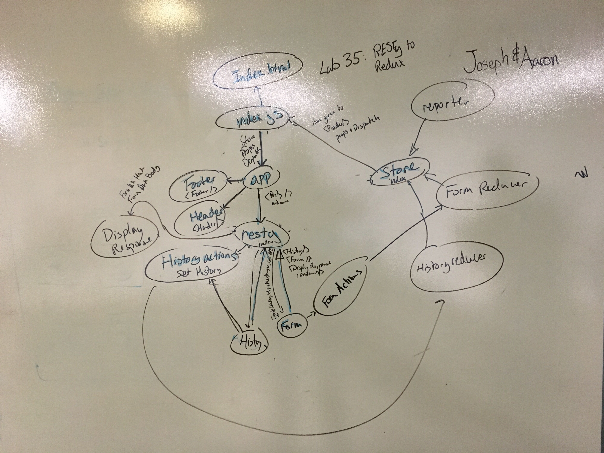

 Lab 33: Remote APIs  
============================================================================    
Date: May 3rd, 2019    
Authors: Joseph Wolfe, Aaron Ferris  


[Pull request](https://github.com/abferris/lab33/pull/1)  
[Deployment](https://amazing-payne-eab3c5.netlify.com/)  
[LAB INSTRUCTIONS](./LAB.md)  
## File  Structure
```.
├── config
│   ├── env.js
│   ├── jest
│   │   ├── cssTransform.js
│   │   └── fileTransform.js
│   ├── modules.js
│   ├── paths.js
│   ├── webpack.config.js
│   └── webpackDevServer.config.js
├── LAB.md
├── package.json
├── package-lock.json
├── public
│   └── index.html
├── README.md
├── scripts
│   ├── build.js
│   ├── start.js
│   └── test.js
└── src
    ├── actions
    │   ├── form-actions.js
    │   └── history-actions.js
    ├── app.js
    ├── components
    │   ├── footer
    │   │   └── index.js
    │   ├── header
    │   │   └── index.js
    │   └── resty
    │       ├── display-response.js
    │       ├── form.js
    │       ├── history.js
    │       ├── index.js
    │       ├── method-handler.js
    │       ├── methods.js
    │       └── resty.css
    ├── index.js
    ├── lib
    │   ├── api.js
    │   └── utils.js
    ├── reducers
    │   ├── form-reducers.js
    │   └── history-reducers.js
    ├── store
    │   ├── index.js
    │   └── reporter.js
    └── style
        ├── reset.css
        └── style.css

14 directories, 36 files
```


## Assignment  
[x] Keeping the core functionality in place, upgrade RESTy
  [x] Convert from component state to a Redux Store
  [ ] Convert from using `superagent` to `fetch`
  [x]  Modularize the component and store tree
  [ ] Fully document the application and all components
  [ ] Fully test the reducers, actions, and units

[x] Use the tools you've built in react to construct an amazing application.
[x] Make this easy and intuitive for a user to use
[x] The User Interface and Experience are completely up to you

  
### Testing  
* Did not have time to get to it
  
## Part 1: Connect to a Store    
    
[part 1 Details](./PART1.md)    
    
### Sandbox Submission  
    
[part one sandbox](https://codesandbox.io/s/n771jx0mz0)    
  
  
